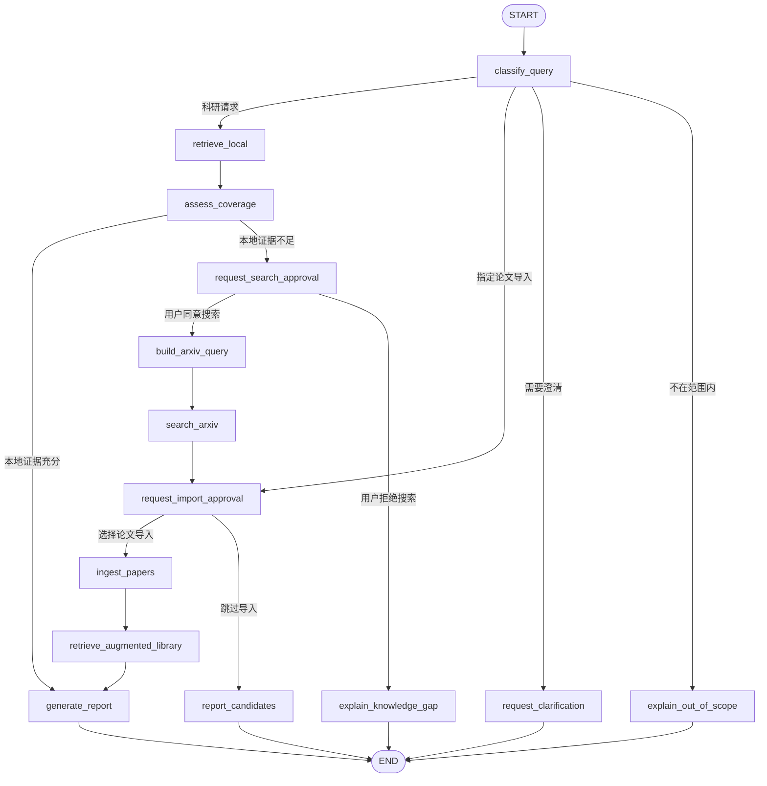

# Agent 主图（节点实现前）

本文件固定主图的节点和路由边界。它不是实现清单：每个节点在单独的后续步骤中完成。



## 节点完成顺序

1. `classify_query`
2. `retrieve_local`
3. `assess_coverage`
4. `request_search_approval`
5. `build_arxiv_query`
6. `search_arxiv`
7. `request_import_approval`
8. `ingest_papers`
9. `retrieve_augmented_library`
10. `generate_report`
11. `request_clarification`、`explain_out_of_scope`、`explain_knowledge_gap` 与 `report_candidates`

## 已完成：`classify_query`

该节点使用 LangChain Runnable 组合，不手写 JSON 提取或 Pydantic 解析：

```text
ChatPromptTemplate
+ MessagesPlaceholder(chat_history, 最近 4 条)
+ create_agent(..., response_format=ToolStrategy(QueryIntent))
+ Runnable.with_retry(stop_after_attempt=2)
```

分类结果中的 `intent.route` 由确定性路由函数消费：

```text
research             → retrieve_local
direct_import        → request_import_approval
needs_clarification  → request_clarification
out_of_scope         → explain_out_of_scope
```

分类上下文固定包含当前查询、限长会话摘要、最近消息与最多五篇活跃论文的简写 metadata；分类结果是内部状态，不写入面向用户的聊天历史。

## 已完成：`retrieve_local`

这是确定性 RAG 节点，不是 Agent，不使用 MiniMax。它固定使用原始用户问题作为 embedding query，避免分类 Agent 的可变关键词改变首次召回；然后通过 LangChain Chroma 的带相关性分数检索接口获取候选 chunk。

- 取最多 12 个候选；分数只用于排序，不采用固定绝对阈值；每篇论文最多保留 2 个 chunk。
- 对用户明确写出的英文模型名、论文 ID 等实体，标题或正文中的精确命中优先排序。
- 每个入选结果必须有 `paper_id`、`chunk_id`、`title`，可选 `page_number`；缺少引用溯源数据会显式失败。
- 空库或没有达到阈值的结果返回空 `local_evidence`，后续 `assess_coverage` 负责决定是否请求 arXiv 搜索权限。

## 已完成：`request_import_approval`

该节点是下载与向量化之前的第二个人工关卡。它对 arXiv 搜索结果生成可展示的候选论文 payload，使用 LangGraph `interrupt()` 暂停；调用方以相同 `thread_id` 通过 `Command(resume={"decision": "select", "selected_paper_ids": [...]})` 或 `{"decision": "skip"}` 恢复。选择的 ID 必须出现在中断 payload 中，无法从恢复请求伪造额外导入目标。直接导入请求中的 arXiv ID、DOI 和 URL 也会先统一为候选项，再要求确认。

## 已完成：`ingest_papers`（arXiv PDF 主路径）

节点只接受已通过 `request_import_approval` 选中的 arXiv ID。它以原子 `.part` 文件下载 PDF，限制文件大小，复用合法的本地下载；再复用既有的版面解析、章节分块、DashScope embedding 与 Chroma 稳定 chunk ID upsert。SQLite 保存每次导入任务的 `started`、`completed` 或 `failed` 状态，以及论文和版本元数据；失败后重新执行可安全覆盖同一篇论文的向量。DOI 与普通 URL 已能经过人工审批，但尚未实现可靠 PDF 解析器，因此会明确拒绝自动下载而非猜测文件地址。

## 已完成：`retrieve_augmented_library`

新论文写入 Chroma 后，节点先按 `paper_id` metadata filter 检索本次导入的论文，再检索整个库，并按 chunk ID 去重合并。最终证据优先保留新论文的高相关 chunk，同时补充已有本地文献；输出 `final_evidence`、引用 ID、新论文命中 ID 与完整检索统计，供 `generate_report` 使用。

## 已完成：`generate_report`

报告生成使用没有工具权限的结构化 LangChain Agent。每条主张必须返回已给定的 `evidence_id`，以及从该 evidence excerpt 逐字复制的 `supporting_quote`；工作流校验证据 ID 与逐字摘录后，才统一渲染论文标题、章节和页码。若 Agent 引用了不存在的 chunk 或杜撰摘录，节点会失败而不会输出不可溯源的报告。未经历导入的“本地证据充分”路径会回退使用 `local_evidence`。

## 已完成：`assess_coverage`

该节点只判断本地证据是否足够回答，不生成回答。没有 `local_evidence` 时由确定性规则直接要求 arXiv 搜索审批；有证据时使用结构化 `CoverageAssessment` Agent 输出 `sufficient`、置信度、缺失方面和下一步动作。其结构化结果由确定性边路由到 `generate_report` 或 `request_search_approval`。

## 已完成：`request_search_approval`

当本地证据不足时，节点使用 LangGraph `interrupt()` 暂停并返回 JSON 审批载荷。调用方必须以同一个 `thread_id` 使用 `Command(resume={"decision": "approve" | "reject"})` 恢复；SQLite checkpointer 会持久化暂停状态。批准后才路由到 `build_arxiv_query`，拒绝则进入 `explain_knowledge_gap`。

## 已完成：`build_arxiv_query`

该 Agent 节点必须先验证 `search_approval == "approved"`，再根据 `QueryIntent` 与 `CoverageAssessment` 输出结构化关键词、分类、理由与结果上限；不执行网络请求。确定性工具层使用 `arxiv.py` 构造 API 表达式并完成请求、分页和 Atom 解析，Agent 不生成 arXiv DSL。

## 已完成：四个终止分支

- `request_clarification`：返回分类 Agent 已结构化给出的澄清问题。
- `explain_out_of_scope`：明确说明能力边界，不假装完成科研检索。
- `explain_knowledge_gap`：当用户拒绝 arXiv 搜索时，基于 coverage 结果说明本地证据缺口。
- `report_candidates`：当用户跳过导入时，只汇报本轮 arXiv 候选的标题、ID 与链接，不执行下载或向量化。

四者均为确定性终止节点，无模型调用、无外部写入；至此主图中的全部节点均已有实际实现。

## 路由不变量

- `search_arxiv` 只可能从 `request_search_approval` 的 `approved` 分支到达。
- `ingest_papers` 只可能从 `request_import_approval` 的 `selected` 分支到达，且至少选择一篇论文。
- 任何路由所需状态缺失时，图抛出 `WorkflowRoutingError`，不猜测用户意图。
